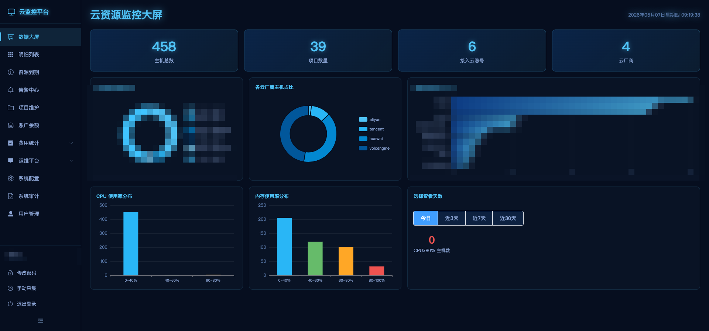
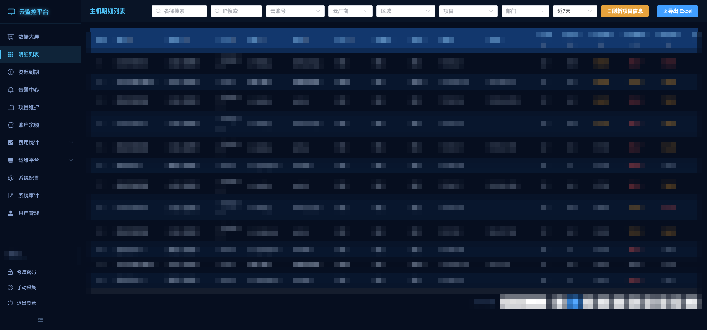
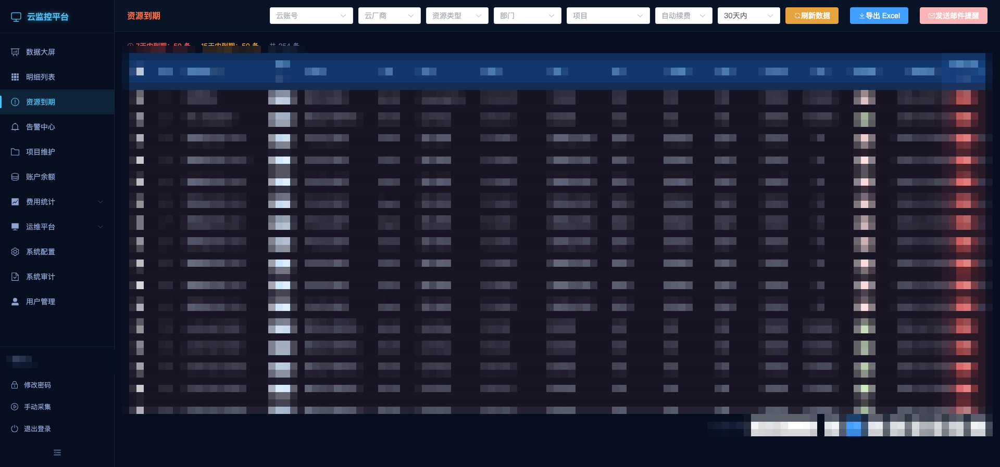
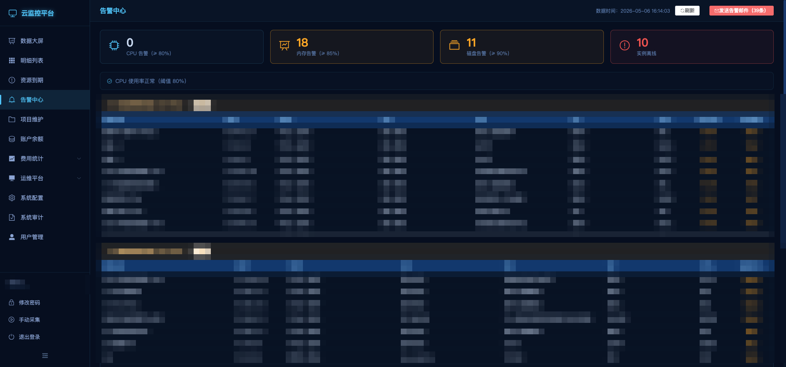
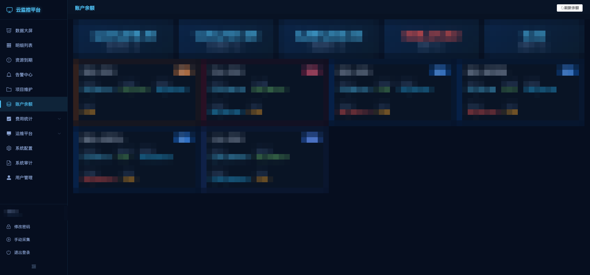
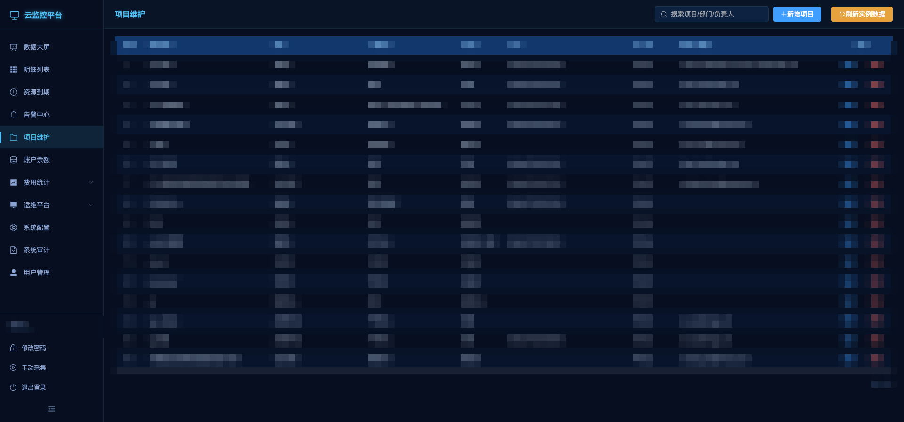
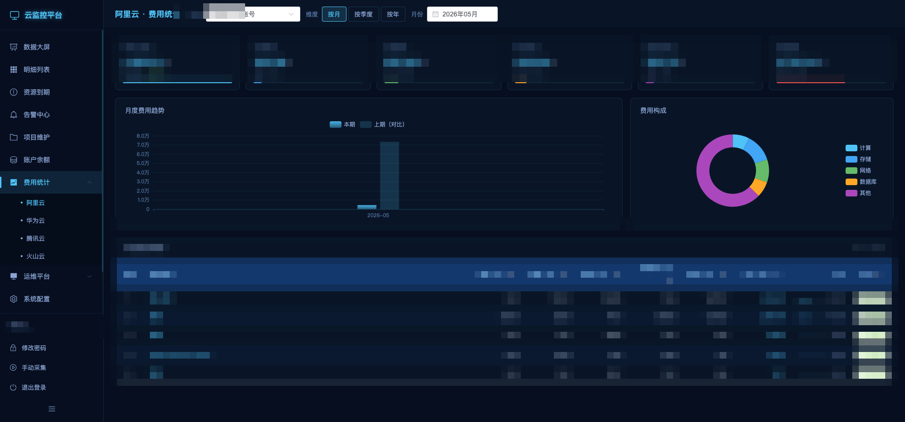
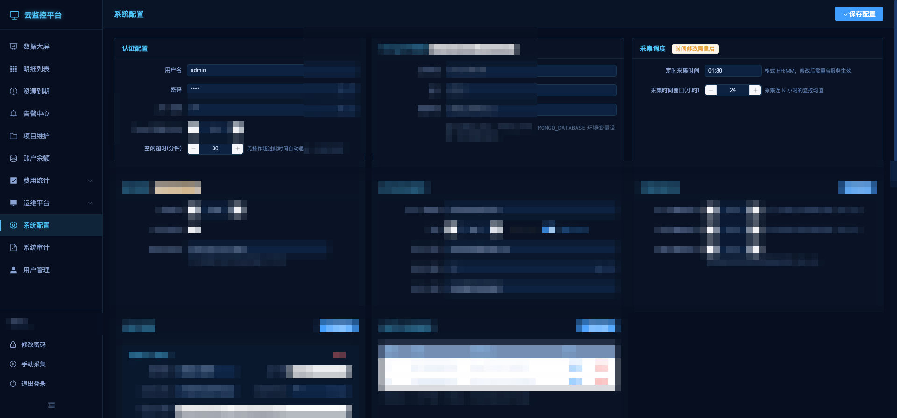
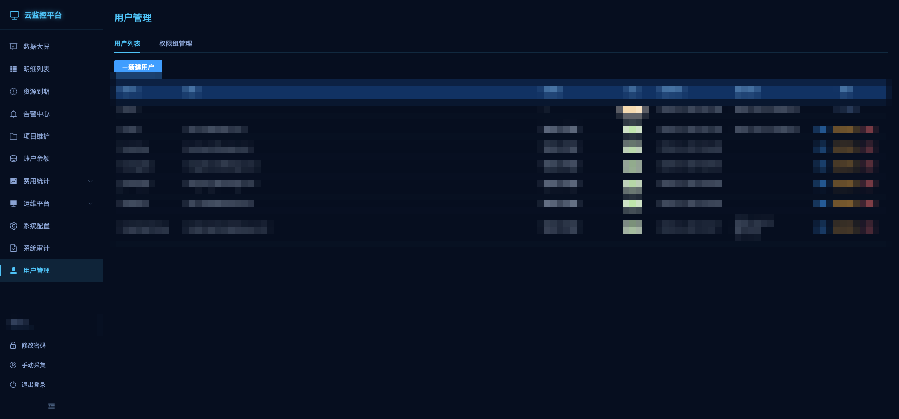

# CloudScope — 多云统一运维监控平台

> 一站式统一管理阿里云、华为云、腾讯云、火山云的运维监控平台。  
> 从指标采集、智能告警、资源到期预警，到账户余额与费用趋势，全部覆盖。

[](https://python.org)
[](https://vuejs.org)
[](https://flask.palletsprojects.com)
[](https://mongodb.com)
[](LICENSE)

---

## 为什么做这个项目

企业同时使用多家云厂商时，运维团队面临以下痛点：

- **监控分散**：每家云厂商的控制台各自独立，跨账号查询极其繁琐
- **告警缺失**：默认云监控告警配置复杂，难以快速判断全局健康状态
- **资源失控**：包年包月实例到期无感知，临时实例长期闲置浪费成本
- **费用不透明**：多账号费用散落在各平台，无法快速汇总

CloudScope 解决上述所有问题：**一个平台、一次登录、全局视野。**

---

## ✨ 功能亮点

| 模块 | 功能 |
|------|------|
| **数据大屏** | 实时展示全云账号主机数、项目数、CPU/内存使用率分布、Top 15 项目主机数 |
| **主机明细** | 多维筛选（云账号/厂商/区域/项目/部门），CPU 峰值排序，导出 Excel |
| **资源到期** | 7天/15天到期预警，按项目批量发送邮件提醒，支持覆盖单条通知人 |
| **告警中心** | CPU/内存/磁盘/离线四类告警，阈值自定义，批量邮件通知（多地址逗号分隔）|
| **账户余额** | 实时查询各云账号现金余额、授信额度、代金券、欠费情况 |
| **费用统计** | 月度/季度/年度费用趋势，支持阿里云、华为云、腾讯云、火山云 |
| **项目维护** | 项目-部门-负责人映射，Excel 批量导入，绑定通知邮箱 |
| **系统配置** | 云账号 AK/SK、邮件、JWT 等全部存入 MongoDB，无本地配置文件 |
| **用户权限** | 多用户 + 权限组，细粒度菜单/操作权限，登录审计日志 |

---

## 📸 界面截图

### 数据大屏

实时汇总全云账号主机健康状态，通过 ECharts 图表直观呈现 CPU/内存使用率分布与项目主机占比。



### 主机明细列表

支持按云账号、厂商、区域、项目、部门多维筛选，一键导出 Excel，快速定位高负载主机。



### 资源到期预警

自动汇总 7 天/15 天内到期资源，支持批量发送邮件提醒，防止资源因未续费意外下线。



### 告警中心

四类告警（CPU / 内存 / 磁盘 / 离线）一目了然，可统一发送至指定邮箱或覆盖为新联系人。



### 账户余额

实时拉取各云账号余额，现金、授信、代金券、欠费情况一页呈现，财务巡查效率翻倍。



### 项目维护

维护项目-部门-负责人映射关系，与告警/到期提醒联动，精确推送给对应责任人。



### 费用统计

按月/季/年查看各云账号费用趋势，细化到计算、存储、网络、数据库等各类支出，项目维度费用明细一览。



### 系统配置

所有云账号 AK/SK、邮件服务器、告警阈值、采集调度等配置统一在线维护，无需修改任何本地文件，敏感字段自动脱敏展示。



### 系统审计

记录所有用户的登录行为和敏感操作（查看明文密码等），支持按操作类型筛选，保障平台操作可追溯。


### 用户管理

多用户账号体系，支持权限组分配，细粒度控制各用户可访问的菜单与操作权限，支持一键重置密码并邮件通知。



---

## 🏗 技术栈

| 层 | 技术 |
|---|---|
| 前端 | Vue 3 + Vite + Element Plus + ECharts |
| 后端 | Python 3.9 + Flask 3 + JWT 认证 |
| 数据库 | MongoDB 5.0+（PyMongo） |
| 调度 | schedule 库（daemon 线程，每日定时采集）|
| 邮件 | SMTP（smtplib，后台线程异步发送）|
| 部署 | Docker / Docker Compose / Kubernetes |

---

## 🌥 支持的云厂商

| 云厂商 | 监控指标 | 账户余额 | 资源到期 | 费用统计 |
|--------|---------|---------|---------|---------|
| 阿里云 | CPU / 内存 / 磁盘 / 带宽 | ✅ | ✅ | ✅ |
| 华为云 | CPU / 内存 / 磁盘 / 带宽 | ✅ | ✅ | ✅ |
| 腾讯云 | CPU / 内存 / 磁盘 / 带宽 | ✅ | ✅ | ✅ |
| 火山云 | CPU / 内存 / 磁盘 | ✅ | ✅ | ✅ |

---

## 🚀 快速开始

### 环境要求

- Python 3.9+
- Node.js 18+（仅开发时构建前端需要）
- MongoDB 5.0+

### 1. 克隆并安装依赖

```bash
git clone https://github.com/your-username/cloudscope.git
cd cloudscope
pip install -r requirements.txt -i https://mirrors.aliyun.com/pypi/simple/
```

### 2. 启动（直接运行）

```bash
# 指定 MongoDB 连接，首次启动自动初始化默认配置
MONGO_HOST=<your-mongodb-host> MONGO_DATABASE=cloud_monitor_v2 python main.py
```

> 首次启动后，用默认账号 **admin / Admin@123** 登录，进入「系统配置」填写云账号 AK/SK 及邮件配置。  
> 登录后请立即修改默认密码。

### 3. Docker Compose 部署（推荐）

```yaml
# docker-compose.yml
services:
  cloudscope:
    image: cloudscope
    build: .
    ports:
      - "5002:5002"
    environment:
      - MONGO_HOST=<mongodb-host>
      - MONGO_PORT=27017
      - MONGO_DATABASE=cloud_monitor_v2
    restart: unless-stopped
```

```bash
docker compose up -d
```

### 4. 前端开发构建

```bash
cd frontend
npm install
npm run dev    # 开发热更新
npm run build  # 生产构建，产物供 Flask 直接 serve
```

---

## ⚙️ 配置管理

**所有敏感配置（AK/SK、邮件密码、JWT 密钥）均存储在 MongoDB，不存在于任何本地文件。**

通过环境变量指定 MongoDB 连接（唯一需要外部配置的参数）：

| 环境变量 | 说明 | 默认值 |
|---------|------|--------|
| `MONGO_HOST` | MongoDB 主机地址 | `localhost` |
| `MONGO_PORT` | MongoDB 端口 | `27017` |
| `MONGO_DATABASE` | 数据库名 | `cloud_monitor_v2` |

---

## 📡 API 接口

所有接口（除 `/api/login`）需携带 `Authorization: Bearer <token>` 请求头。

### 核心接口

| 方法 | 路径 | 说明 |
|------|------|------|
| POST | `/api/login` | 登录，返回 JWT（含菜单/操作权限）|
| GET  | `/api/summary?days=N` | 大屏汇总数据 |
| GET  | `/api/metrics` | 主机明细（分页 + 多维筛选）|
| GET  | `/api/export` | 导出 Excel |
| POST | `/api/collect` | 手动触发采集 |
| GET  | `/api/collect/status` | 采集进度 |

### 告警

| 方法 | 路径 | 说明 |
|------|------|------|
| GET  | `/api/alerts` | 获取当前告警（CPU/内存/磁盘/离线）|
| GET  | `/api/alert-thresholds` | 获取告警阈值 |
| POST | `/api/alert-thresholds` | 保存告警阈值 |
| POST | `/api/alert/send-email` | 发送告警邮件（支持追加/替换模式，多邮箱逗号分隔）|

### 资源到期

| 方法 | 路径 | 说明 |
|------|------|------|
| GET  | `/api/expiry` | 到期资源列表 |
| POST | `/api/expiry/refresh` | 手动触发采集 |
| POST | `/api/expiry/send-email` | 发送到期提醒邮件 |
| GET  | `/api/expiry/export` | 导出 Excel |

### 账户余额 & 费用

| 方法 | 路径 | 说明 |
|------|------|------|
| GET  | `/api/balance` | 各云账号余额（实时）|
| GET  | `/api/cost/providers` | 费用统计云厂商列表 |
| GET  | `/api/cost/<provider>` | 费用统计数据 |

### 系统管理

| 方法 | 路径 | 说明 |
|------|------|------|
| GET  | `/api/config` | 获取配置（敏感字段脱敏）|
| POST | `/api/config` | 保存配置 |
| GET  | `/api/users` | 用户列表（仅管理员）|
| POST | `/api/users` | 创建用户 |
| GET  | `/api/permission-groups` | 权限组列表 |
| GET  | `/api/audit/logs` | 审计日志 |

---

## 🗄 数据库集合

| 集合 | 说明 |
|------|------|
| `system_config` | 应用配置 + 告警阈值 |
| `instances` | 实例信息（每次采集 upsert）|
| `metrics` | 监控快照（追加，保留 90 天）|
| `expiry_resources` | 到期资源快照 |
| `cost_records` | 费用统计记录 |
| `projects` | 项目维护（部门/负责人/通知邮箱）|
| `users` | 用户表 |
| `permission_groups` | 权限组 |
| `audit_logs` | 审计日志 |

---

## 🔌 扩展新云厂商

1. 在 `providers/` 新建 `xxx.py`，继承 `CloudProvider`
2. 实现 `get_instances(region)` 和 `get_metrics(instance_id, region, hours)`
3. 可选实现：`get_balance()`、`get_expiring_resources()`、`get_all_metrics_batch()`
4. 在 `providers/__init__.py` 的 `create_provider()` 中注册
5. 前端「系统配置」添加对应云账号

---

## 🔒 安全设计

- 密码使用 `bcrypt` 哈希存储
- JWT 认证，token 有效期可配置
- 敏感配置字段（SK、密码、JWT 密钥）返回时统一脱敏为 `****`
- 查看明文需二次输入管理员密码，操作记录到审计日志
- 代码仓库中无任何密钥或 AK/SK

---

## 📝 注意事项

- 华为云 CES 监控为逐实例串行调用，实例较多时采集耗时约 10 分钟/100 台
- 阿里云 BSS 金额含千位逗号分隔符（已自动处理）
- 腾讯云 Billing 金额单位为分（已自动转换）
- 修改项目/部门映射后在「项目维护」页面执行刷新操作

---

## 🤝 Contributing

欢迎提交 Issue 和 PR。新增云厂商适配、告警渠道（钉钉/企业微信/飞书）、Grafana 数据源等方向均受欢迎。

---

## License

[MIT](LICENSE)
